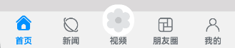

# 自定义TabBar页签案例

### 介绍

TabBar在大部分的APP当中都能够使用到，不同的APP可能存在不一样的TabBar样式，Tab组件自带的TabBar属性对于部分效果无法满足，如页签中间显示一圈圆弧外轮廓等，
因此我们需要去自己定义一个TabBar页签来满足开发的需要。

### 效果图预览



**使用说明**：

1. 依次点击tabBar页面，除了社区图标之外，其它图标往上移动一小段距离。

### 下载安装

1.模块oh-package.json5文件中引入依赖
```typescript
"dependencies": {
  "customtabbar": "har包地址"
}
```
2.ets文件import自定义视图实现Tab效果组件
```typescript
import { CustomTabBar } from 'customtabbar';
```

### 快速使用

本章节主要介绍了如何快速使用自定义视图来实现Tab效果组件，包括数据源的初始化以及Tab自定义组件的构建。

1. 初始化tab数据源。数据源的类型为[TabBarInfo](./src/main/ets/model/DataType.ets)。

```typescript
const TAB_INFO: TabBarInfo[] = [
  new TabBarInfo(0, $r('app.string.custom_tab_home'), $r("app.media.custom_tab_home_selected"),
    $r("app.media.custom_tab_home"), $r('app.color.custom_tab_selected_text_color'),
    $r('app.color.custom_tab_text_color')),
  new TabBarInfo(1, $r('app.string.custom_tab_news'), $r("app.media.custom_tab_new_selected"),
    $r("app.media.custom_tab_new"), $r('app.color.custom_tab_selected_text_color'),
    $r('app.color.custom_tab_text_color')),
  new TabBarInfo(2, $r("app.string.custom_tab_video"), $r("app.media.custom_tab_video_selected"),
    $r("app.media.custom_tab_video"), $r('app.color.custom_tab_selected_text_color'),
    $r('app.color.custom_tab_text_color')),
  new TabBarInfo(3, $r("app.string.custom_tab_friend"), $r("app.media.custom_tab_friend_selected"),
    $r("app.media.custom_tab_friend"), $r('app.color.custom_tab_selected_text_color'),
    $r('app.color.custom_tab_text_color')),
  new TabBarInfo(4, $r('app.string.custom_tab_mine'), $r("app.media.custom_tab_user_selected"),
    $r("app.media.custom_tab_user"), $r('app.color.custom_tab_selected_text_color'),
    $r('app.color.custom_tab_text_color'))];

private tabsInfoArr: TabBarInfo[] = TAB_INFO;

```

2. 构建Tab组件。 开发者可以根据自己的设计将CustomTabBar自定义视图布置在页面合适的位置，并传递对应的参数。

```typescript
/**
 * 自定义TabBar组件
 * selectedIndex: 配置起始的页签索引（必传）
 * tabsInfo: tab数据源，类型为TabBarInfo
 */
CustomTabBar({ selectedIndex: this.selectedIndex, tabsInfo: this.tabsInfoArr })
```

### 属性(接口)说明

CustomTabBar组件属性

|      属性       |              类型               |                            释义      |    默认值    |
|:-------------:|:----------------------------:|:-----------------------------:|:---------:|
| selectedIndex |              number        |         配置起始的页签索引     |     0     |
|   tabsInfo    |            TabBarInfo[]       |        tab数据源           |     -     |

TabInfo类属性

|        属性         |      类型      |    释义     |                   默认值                   |
|:-----------------:|:------------:|:---------:|:---------------------------------------:|
|        id         |    number    |   页签id    |                    -                    |
|       title       |    string    |   页签标题    |                    -                    |
|   selectedIcon    |  ResoureStr  |   被选中图片   | $r('app.media.custom_tab_default_icon') |
|    defaultIcon    |  ResoureStr  |   默认图片    | $r('app.media.custom_tab_default_icon') |
| selectedFontColor | ResoureColor | 被选中页签文本颜色 |                    -                    |
| defaultFontColor  | ResoureColor | 默认页签文本颜色  |                    -                    |


### 实现思路

**场景1：TabBar中间页面实现有一圈圆弧外轮廓**

将Image组件外层包裹一层容器组件，通过设置borderRadius以及margin的top值实现圆弧外轮廓效果。
这里borderRadius的值设置为容器组件宽度的一半，margin的top值根据开发者的ux效果设置合适的值即可。
具体代码可参考[TabView.ets](./src/main/ets/view/TabView.ets)

```typescript
  Column() {
    Image(this.selectedIndex === tabBarIndex ? this.tabsInfo[tabBarIndex].selectedIcon :
    this.tabsInfo[tabBarIndex].defaultIcon)
      .size({
        width: $r('app.integer.custom_tab_community_image_size'),
        height: $r('app.integer.custom_tab_community_image_size')
      })
      .interpolation(ImageInterpolation.High) // TODO：知识点：使用interpolation属性对图片进行插值，使图片显示得更清晰
  }
  .width($r('app.integer.custom_tab_community_image_container_size'))
  .height($r('app.integer.custom_tab_community_image_container_size'))
  // TODO：知识点：通过设置borderRadius以及margin的top值实现圆弧外轮廓效果。
  .borderRadius($r('app.integer.custom_tab_community_image_container_border_radius_size'))
  .margin({ top: CommonConstants.ARC_MARGIN_TOP })
  .backgroundColor(Color.White)
  .justifyContent(FlexAlign.Center)
  
```
**场景2：TabBar页签点击之后会改变图标显示，并有一小段动画效果**

改变图标显示功能可以先声明一个变量selectedIndex，此变量代表被选定的tabBar下标，点击的时候将当前tabBar的下标值进行赋值。
通过当前被选中的tabBar下标值和tabBar自己的下标值进行判断来达到点击之后改变图标显示的效果。
动画效果可以将Image添加一个offset属性和[animation属性](https://developer.huawei.com/consumer/cn/doc/harmonyos-references-V5/ts-animatorproperty-V5)，
offset属性可以控制组件的横向和纵向偏移量； animation在组件的某些通用 属性变化时，可以通过属性动画animation实现过
渡效果。 点击TabBar页签，改变offset的属性值，自动触发animation属性动画。
具体代码可参考[TabView.ets](./src/main/ets/view/TabView.ets)

```typescript
Column() {
  // 通过被选中的tabBar下标值和tabBar的默认下标值来改变图片显示
  Image(this.selectedIndex === tabBarIndex ? this.tabsInfo[tabBarIndex].selectedIcon :
  this.tabsInfo[tabBarIndex].defaultIcon)// TODO：知识点：使用interpolation属性对图片进行插值，使图片显示得更清晰
    .interpolation(ImageInterpolation.High)
    .size({
      width: $r('app.integer.custom_tab_image_size'),
      height: $r('app.integer.custom_tab_image_size')
    })// TODO：知识点：通过offset控制图片的纵向偏移。
    .offset({
      y: (this.selectedIndex === tabBarIndex &&
        this.selectedIndex !== CommonConstants.COMMUNITY_TAB_BAR_INDEX) ?
      this.iconOffset : $r('app.integer.custom_tab_common_size_0')
    })// TODO：知识点：组件的某些通用属性变化时，可以通过属性动画animation实现过渡效果。本示例的动画效果是tabBar的图片向上偏移一小段距离
    .animation({
      duration: CommonConstants.CUSTOM_ANIMATION_DURATION,
      curve: Curve.Ease,
      iterations: CommonConstants.CUSTOM_ANIMATION_ITERATIONS,
      playMode: PlayMode.Normal
    })
}
.width($r('app.integer.custom_tab_image_container_size'))
.height($r('app.integer.custom_tab_image_container_size'))
.justifyContent(FlexAlign.Center)
```
### 高性能知识点

不涉及。

### 工程结构&模块类型

```
customtabbar                                    // har类型
|---common
|   |---CommonConstants.ets                     // 常量
|---model
|   |---DataType.ets                            // 模型层-Tabbar数据类型
|   |---TabBarData.ets                          // 数据模型层-TabBar数据
|---util
|   |---CustomTabBar.ets                        // 核心组件
|   |---Logger.ets                              // 日志
|---view
|   |---TabView.ets                             // 视图层-自定义TabBar页面
```
### 模块依赖

不涉及。

### 参考资料
[属性动画(animation)](https://developer.huawei.com/consumer/cn/doc/harmonyos-references-V5/ts-animatorproperty-V5)

[Tabs组件](https://developer.huawei.com/consumer/cn/doc/harmonyos-references-V5/ts-container-tabs-V5)


